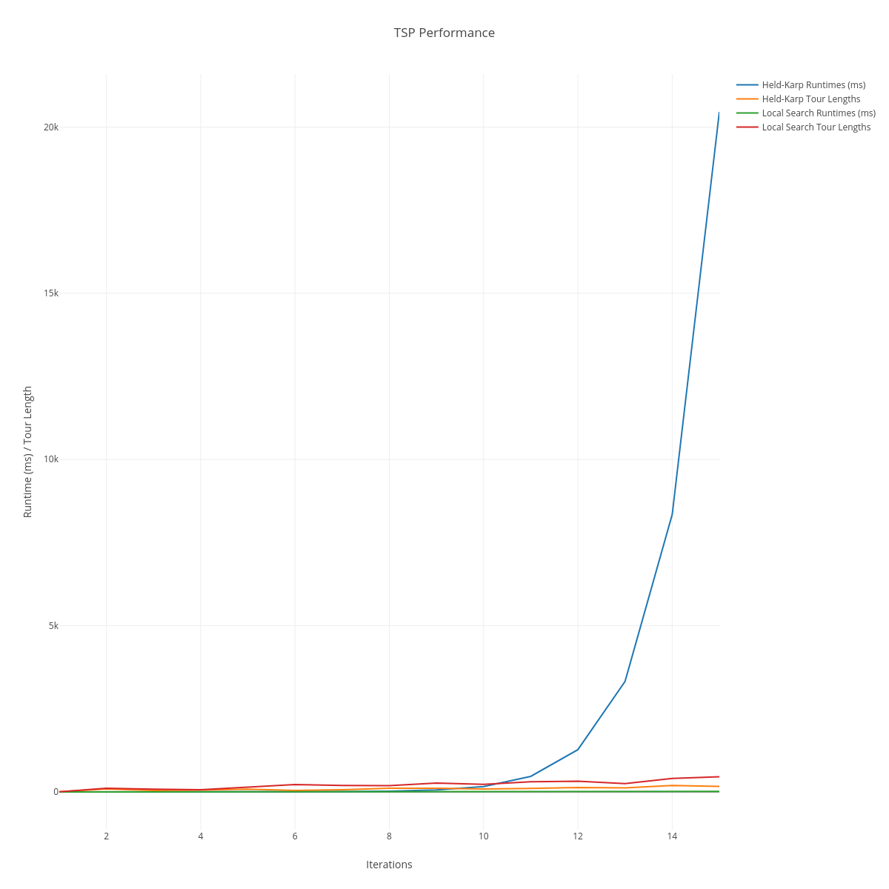
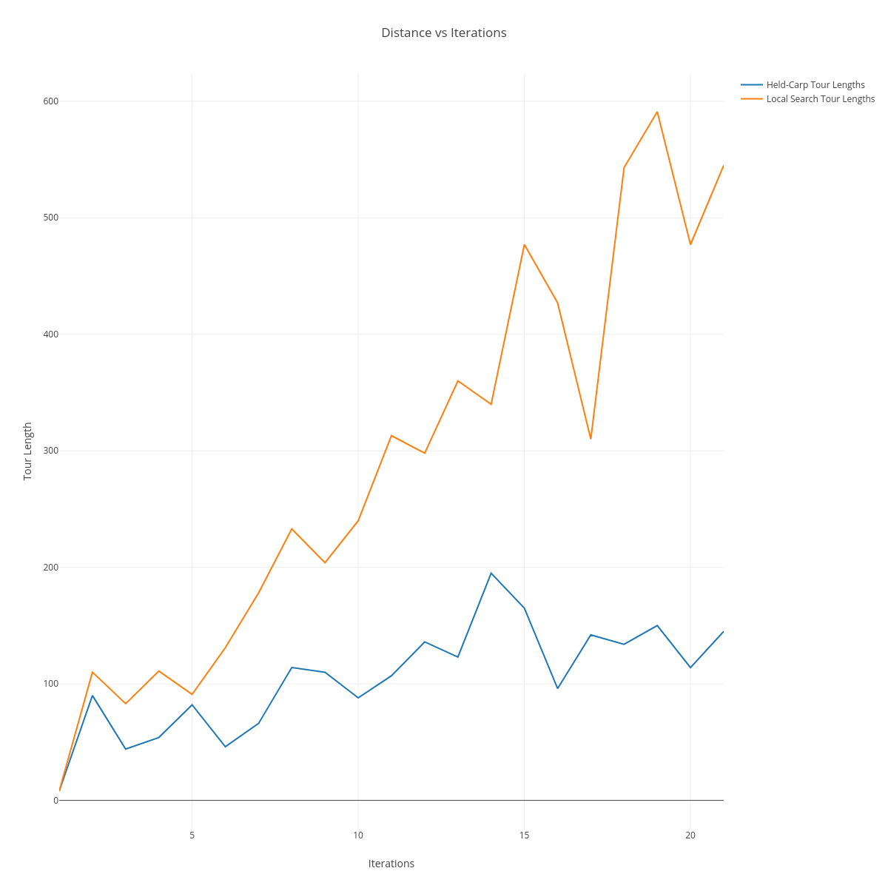

[](https://classroom.github.com/a/7Wc93oxi)

# Traveling Salesperson Problem -- Empirical Analysis

For this exercise, you'll need to take the code from the TSP Held-Karp and TSP
Local Search exercises. This can be your own implementation or somebody else's.
You will now do an empirical analysis of the implementations, comparing their
performance. Both the Held-Karp and the Local Search algorithms solve the same
problem, but they do so in completely different ways. This results in different
solutions, and in different times required to get to the solution.

Investigate the implementations' empirical time complexity, i.e. how the runtime
increases as the input size increases. _Measure_ this time by running the code
instead of reasoning from the asymptotic complexity (this is the empirical
part). Create inputs of different sizes and plot how the runtime scales (input
size on the $x$ axis, time on the $y$ axis). Your largest input should have a
runtime of _at least_ an hour. The input size that gets you to an hour will
probably not be the same for the Held-Karp and Local Search implementations.

In addition to the measured runtime, plot the tour lengths obtained by both
implementations on the same input distance matrices. The length of the tour that
Held-Karp found should always be less than or equal to the tour length that
Local Search found. Why is this?

Add the code to run your experiments, graphs, and an explanation of what you did
to this markdown file.

## Resources

https://www.codecademy.com/resources/docs/markdown/tables

## Reproductability

If you want to reproduce the code then please make sure you have `g++` and patience xD. I took my javascript code and ported it to c++ as I was running into issues with the javascript `Map()` running out of memory way too quickly.

You will need a plotly account and create a `.env` file with a `USERNAME & PASSWORD` variables.

Here is an example:

```.env
PASSWORD=34nkhrkndfi3j53kjn54
USERNAME=lars_whatever
```

Then you can build the c++ project and execute the main executable. This will test for one hour atleast. After I gather data for one hour of work, I want to have this run for a entire day.

```bash
g++ -std=c++20 -o main src/main.cpp src/tsp-hk.cpp src/tsp-ls.cpp && ./main
```

To create graphs for both local and held-karp just run

```bash
node graphs.js
```

To do the analysis on just local search:

```bash
g++ -std=c++20 -o main src/measureJustLs.cpp src/tsp-hk.cpp src/tsp-ls.cpp -o tspls_analysis && ./tspls_analysis
```

## Analysis

This analysis is done in two parts. First I was just trying to get a baseline reading of how the **Held-Karp** and **Local-Search** algorithms compared. However after running the algorithmn's side by side and gathering data, I realized that the **Held-Karp** is much much slower than the **Local-Search** method. Thats why my second part of this analysis is to analize just how far I could reasonably take the **Local-Search** implimentation.

### Overview

Overall the two algorithms solve the same problem using drasticaly diferent methods. In every test where $n > 2$ the **Held-Karp(hk)** method to find the shortest tour took the lead providing a shortest tour compared to the **Local-Search(ls)** implimentation. This gain in distance came at a massive cost; The runtime of **hk** is exponential compared to it's polynomial counterpart in **ls**.

However, the improvement between **hk** and **ls** appears to be linear. Therefore, with any input size over $n > 20 $ the **hk** becomes impractical as the time needed to compute such a large tour reaches hours compared to a few milliseconds.

## Gathering Data

At first I wanted to run these tests using Javascript. I made this decision as my code was already written in Javascript and it would be easy to further optimize and generate pretty graphs. Quickly **NodeJS** ran out of memory as the **hk** algorithm's cache was exceeding **Node**'s allowed runtime stack size. I decided If I wanted this to be a fair comparison, I should run this in \*\*c++. After porting the code over and adding additional optimizations in this was the process of gathering data.

1. I began with a $2x2$ distance matrix and compared the times to find a tour. I kept track of the time elapsed in **milliseconds** aswell as the shortest distance each method found.

2. I would then repeat this process with as large of a $nxn$ distance matrix as I could. I made sure to stop the test after 12 hours of running elapsed. The code below is the bread and butter of generating the data for the graphs.

```cpp
while (true) {
    auto currentTime = chrono::high_resolution_clock::now();
    chrono::duration<double> elapsed =
        chrono::duration_cast<chrono::seconds>(currentTime - startTime);

    if (elapsed.count() >= (ONE_HOUR * 12)) {
      cout << "Time limit of 12 hours reached. Stopping experiments." << endl;
      break;
    }

    vector<vector<int>> distances = generateRandomDistanceMatrix(size++);

    auto hkStartTime = chrono::high_resolution_clock::now();
    int hkTourLength = tsp_hk(distances);
    auto hkEndTime = chrono::high_resolution_clock::now();
    long long hkRuntime =
        chrono::duration_cast<chrono::milliseconds>(hkEndTime - hkStartTime)
            .count();

    auto lsStartTime = chrono::high_resolution_clock::now();
    int lsTourLength = tsp_ls(distances);
    auto lsEndTime = chrono::high_resolution_clock::now();
    long long lsRuntime =
        chrono::duration_cast<chrono::milliseconds>(lsEndTime - lsStartTime)
            .count();

    // Store the results
    hkRuntimes.push_back(hkRuntime);
    lsRuntimes.push_back(lsRuntime);
    hkTourLengths.push_back(hkTourLength);
    lsTourLengths.push_back(lsTourLength);

    // Output size and results for the current iteration
    cout << "Size: " << size << endl;
    cout << "Held-Karp Runtime (ms): " << hkRuntime << endl;
    cout << "Local Search Runtime (ms): " << lsRuntime << endl;
    cout << "Held-Karp Tour Length: " << hkTourLength << endl;
    cout << "Local Search Tour Length: " << lsTourLength << endl;
    cout << endl;

    writeResultsToFile(hkRuntimes, lsRuntimes, hkTourLengths, lsTourLengths);
  }
```

3. After I had generated some data which could be easily parsed, I switched over to Javascript to generate some graphs which could be used to visualize this information.

```js
function parseData() {
  const resultsData = fs.readFileSync("results.txt", "utf-8");
  const lines = resultsData.split("\n");
  let iterations = parseInt(lines[0].split("(n): ")[1]);
  const hkRuntimes = lines[2]
    .split("[")[1]
    .split("]")[0]
    .split(" ")
    .filter((p) => p != "")
    .map((p) => parseInt(p));
  const lsRuntimes = lines[3]
    .split("[")[1]
    .split("]")[0]
    .split(" ")
    .filter((p) => p != "")
    .map((p) => parseInt(p));
  const hkTourLengths = lines[4]
    .split("[")[1]
    .split("]")[0]
    .split(" ")
    .filter((p) => p != "")
    .map((p) => parseInt(p));
  const lsTourLengths = lines[5]
    .split("[")[1]
    .split("]")[0]
    .split(" ")
    .filter((p) => p != "")
    .map((p) => parseInt(p));

  const data = {
    iterations,
    hkTourLengths,
    lsTourLengths,
    lsRuntimes,
    hkRuntimes,
  };

  return data;
}
```

After some **beautiful** javascript code which parses the txt file generated with the **c++** program, I was set to use the **Plotly** library for graph generation.




### Comparing Held-Karp and Local-Search

When looking at the data we can see that the **ls** method of finding a shortest tour is much faster than the **hk** method. Infact when plotting the distance vs time it would look like the **ls** method is linear. **local-search** is not linear, however compared to the exponential growth of the **hk** method it looks like it on a graph.

When comparing the improvement in tour lengths, the **hk** has a linear relationship to **ls**. This means for the exponential computation time needed, you only get a linear impropvement. This is not ideal when running for tens of even hundreds of nodes.

**Key Takeaways**

- **Local Search** **MUCH** faster than **Held-Karp**. This massive gain in speed comes at the cost of some accuracy.
- **Held-Karp** Grows expenontialy vs polynomial time with **Local-Search**.
- For anything practical, using **Local-Search** will always be the best option between the two for any large set of data.

### Looking Deeper into Local Search

It was clear that for me to work with larger and larger graphs, I would need to just test **Local-Search** and ignore **Held-Karp**. I also wanted to have some more accuracy with reporting the data this time. Instead of generating one data point for each matrix size, I generated 5 data points. I then would be able to plot the **average**, and **spread**.

To do this I created a new **c++** file which was responsible for gathering the data for **Local-Search**.

```cpp
void measureLocalSearch(int size, ofstream& outFile) {
  vector<long long> runtimes;
  double average = 0;
  for (int i = 0; i < 5; i++) {
    auto start = high_resolution_clock::now();
    vector<vector<int>> matrix = generateRandomDistanceMatrix(size);
    tsp_ls(matrix);
    auto end = high_resolution_clock::now();
    long long duration = duration_cast<milliseconds>(end - start).count();
    runtimes.push_back(duration);
    average += duration;
  }

  average /= runtimes.size();

  outFile << "Size (" << size << ") [ ";
  for (auto runtime : runtimes) {
    outFile << runtime << " ";
  }
  outFile << "] -> Avg (" << average << ")\n" << flush;
}

int main(int argc, char** args) {
  if (argc != 2) {
    cout << "Missing runtime in minutes. \n";
    exit(1);
  }

  const int runtime = atoi(args[1]);
  if (runtime <= 0) {
    cout << "Invalid runtime. Must be >= 0 minutes\n";
    exit(1);
  }

  srand(time(nullptr));
  ofstream outFile("tsp_ls-" + to_string(runtime) + "-min.txt");
  outFile.clear();

  cout << "\nRunning test for " << runtime << " minutes\n";
  auto startTime = high_resolution_clock::now();

  int size = 5;
  while (true) {
    if (duration<double, ratio<60>>(high_resolution_clock::now() - startTime)
            .count() >= runtime) {
      cout << "Time limit of " << runtime << " minutes reached.\n";
      break;
    }

    measureLocalSearch(size++, outFile);
  }

  string fn("node graph-tsp-ls.js " + to_string(runtime));
  system(fn.c_str());

  outFile.close();
  return 0;
}
```

The code to generate the graphs is also much simpler as I am outputing one graph instead of 5. I wanted to see how **Local-Search** handled 1, 10, 30 and 60 minutes. Here are the results:

| Time Limit | Iterations |
| :--------- | ---------: |
| 1 Minute   |         54 |
| 10 Minutes |         97 |
| 30 Minutes |        128 |
| 1 Hour     |        151 |

It is important to note that this time also includes unrelated factors such as:

- Generating the text file.
- computing averages and extra data points for accuracy.

However the data being generated does not include these factors. This means if these operations were instant, I would be able to squeze our around 5x more iterations per time frame. Graphed below are the runtime **average** and **spreads** for computing the **Local-Search** tour length for up to a $nxn$ graph where $n$ is the number of iterations done in $x$ minutes.

Here is the **1 Minute** runtime plot which was able to handle a whole $54x54$ distance matrix.


Here is the **10 Minute** runtime plot which was able to handle a whole $97x97$ distance matrix.


Here is the **30 Minute** runtime plot which was able to handle a whole $128x128$ distance matrix.


Lastly is the **60 Minute** runtime plot which was able to handle a whole $151x151$ distance matrix.


### Final Thoughts

Overall I am very happy with how this imperical analysis turned out. I think the visulization at first is misleading when comparing the **Local-Search** and **Held-Karp** algorithms. However this is simply due to how much worse performing the **Held-Karp** is over the **Local-Search**. If I had more time I would love to make even more improvements to each algorithmn or use industry standard implimentations. I am curious if the analysis would be much diferent.

I also would love to cleanup my testing and graph generation code. However it served it's purpose here and so that's all I can ask for. Please let me know if you have any questions or want more info into other aspects of my testing process.
